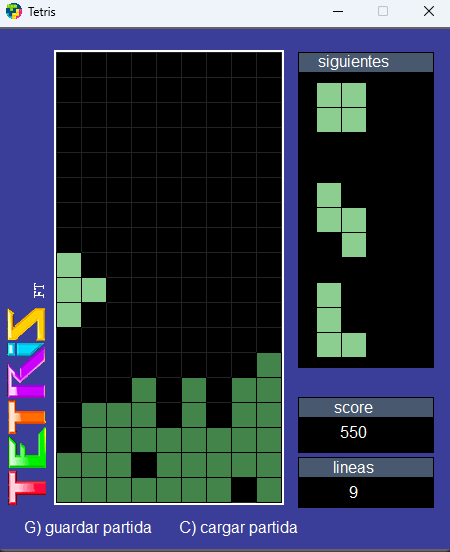

# TP2-Tetris
Este es un trabajo practico realizado para la Facultad de Ingenieria UBA, se utilizo la libreria gamelib propiedad de dessaya https://github.com/dessaya/python-gamelib

## Ejecutable del juego para windows
[Download](https://github.com/FranTapia01/TP2-Tetris/raw/main/dist/tetris.exe) 

 
